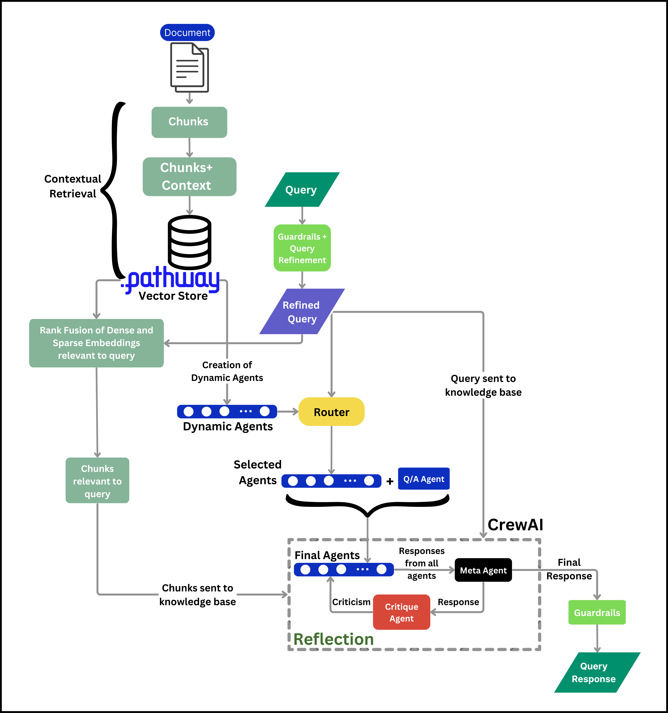

<h1>
  Dynamic Agentic RAG
</h1>


Dynamic Agentic RAG is an application that leverages dynamic agent creation to provide answers to complex queries while harnessing Pathway's cutting-edge vector store for live-streaming data. Architecturally, Dynamic Agentic RAG creates specialist agents on-the-fly based on the source data. It utilizes the OpenAI API, leveraging embeddings and Chat Completion endpoints to craft dynamic, intelligent responses, setting a new benchmark in dynamic RAG with live-streaming data.

## Use Cases

#### Healthcare: Medical Record Analysis
- **Purpose**: Automated summarization and diagnosis assistance 
- **How**: Extracts key patient data, adapts to new formats, and provides timely summaries, diagnosis suggestions, and treatment insights using the latest medical knowledge 

#### Legal: Contract Review and Compliance
- **Purpose**: Streamlined legal document review for compliance 
- **How**: Analyzes document sections to ensure alignment with evolving laws and jurisdictional requirements 

#### Finance: Market Data Processing and Risk Assessment
- **Purpose**: Real-time analysis of market trends and risks  
- **How**: Processes live financial data, detects anomalies, and provides actionable insights and predictions for risk management and investment

## Key Features
- **Dynamic Agents**: Dynamic Agentic RAG dynamically creates agents in real-time, tailored to the streamed documents. This ensures efficiency and adaptability, even when document content changes significantly.
- **Real-Time Data streaming**: Seamless integration with Google Drive to stream live data from a specified folder path.
- **Web Search**: When responses require additional context, users can utilize a web search feature to fetch real-time results directly from the web.
- **Fallback strategy**: A secondary API backup ensures system continuity, maintaining reliability even if the primary API fails.
- **Modularity**:  Dynamic Agentic RAG's modular architecture ensures that all components are independent and reusable, facilitated through Docker for seamless deployment and scalability.  
- **User-Friendly UI via Gradio**: Dynamic Agentic RAG leverages a Gradio-powered interface, making navigation intuitive and document analysis straightforward, so users can focus on their tasks without technical overhead.

## Future Enhancements
- **Integrating Notion**: Extend Dynamic Agentic RAG's capabilities to work seamlessly with Notion workspaces. This integration will allow users to retrieve, analyze, and interact with documents and databases stored in Notion for enhanced productivity.
- **Multi-Modal Integration**: Extend support to handle diverse data types such as images, videos, and audio, allowing Dynamic Agentic RAG to cater to a broader range of use cases, including multimedia analysis and processing.
- **Specialised Mathematical Tools**: Equip Dynamic Agentic RAG with tools for advanced mathematical problem-solving, including symbolic computation, formula generation, and numerical analysis, to cater to fields like engineering and research.

## Demo Video
<div align="center">
  
</div>

## Methodology
- **Data Sources**: As the pipeline is designed to handle and work with dynamic data sources , we are giving the functionality that Google drive folder can serve as the source. 

### Streaming Pipeline 
  <div align="center">
  
</div>

- **Data Ingestion and Processing**:  
  Incoming data from Google Drive is seamlessly processed through Dynamic Agentic RAG's pipeline. The data is then split into smaller, manageable chunks using Pathway's [Unstructured Parser](https://github.com/pathwaycom/pathway/blob/main/python/pathway/xpacks/llm/parsers.py#L77-L230). Updates to the source data are automatically synced with the pipeline, enabling real-time Retrieval-Augmented Generation (RAG).
- **Guardrails**:  
  Text integrity is verified by [Guardrails](https://github.com/guardrails-ai/guardrails/blob/main/guardrails/guard.py), ensuring the reliability and quality of processed information.  

- **Query Refinement**:  
  User queries are passed through Guardrails for refinement, improving their clarity and relevance for agent interpretation. 

- **Contextual Retrieval**  

  - *Context Creation*:  
     - For each chunk, context is retrieved using an LLM and concatenated with the chunk itself.  
     - Sparse embeddings are generated by inhereting the base class of pathway's embedder and integrating it with splade encoder, while dense embeddings are created and both stored in [Pathway's Vector Store](https://github.com/pathwaycom/pathway/blob/main/python/pathway/xpacks/llm/vector_store.py#L628-L746).  

  - *Retrieval and Rank Fusion*:  
     - Context is retrieved using Pathway's [KNN Index](https://github.com/pathwaycom/pathway/blob/main/python/pathway/stdlib/ml/index.py#L9-L301).  
     - Rank fusion calculates the harmonic mean of scores derived from both dense and sparse embeddings, ensuring an accurate final score for each document.  

- **Dynamic Agent Generation**:  
  - Dynamic agents are generated using an LLM by leveraging the context of documents stored in the vector store. This process runs parallel to retrieval and rank fusion, ensuring efficiency.  

- **Router**:  
  - Queries are routed only to the most relevant agents, minimizing unnecessary responses and optimizing performance.  

- **Initial Crew Formation**:  
   - A preliminary crew of agents is formed, including:  
     - Selected agents based on the router's recommendation.  
     - A Question-Answering agent.  
     - A meta-agent, which consolidates retrieved documents, user queries, and knowledge from the entire document corpus.  
   - The crew's outputs are processed by the meta-agent to generate an initial response.  

- **Reflection**:  
   - The meta-agent's output is evaluated by a critique agent, providing feedback and suggestions.  
   - The initial crew iteratively incorporates this feedback, refining the response for `n` iterations.  

- **Final Response**:  
   - The meta-agent's final output is verified by Guardrails before being displayed on the user interface, ensuring a reliable and contextually accurate response. 

## Usage

### Creating credentials.json in the Google API console:
- Go to https://console.cloud.google.com/projectcreate and create new project
- Enable Google Drive API by going to https://console.cloud.google.com/apis/library/drive.googleapis.com, make sure the newly created project is selected in the top left corner
- Configure consent screen:
  - Go to https://console.cloud.google.com/apis/credentials/consent
  - If using a private Gmail, select "External", and go next.
  - Fill required parameters: application name, user support, and developer email (your email is fine)
  - On the next screen click "Add or remove scopes" search for "drive.readonly" and select this scope
  - Save and click through other steps
- Create service user:
  - Go to https://console.cloud.google.com/apis/credentials
  - Click "+ Create credentials" and create a service account
  - Name the service user and click through the next steps
- Generate service user key:
  - Once more go to https://console.cloud.google.com/apis/credentials and click on your newly created user (under Service Accounts)
  - Note service user email address, it will be needed later
  - Go to "Keys", click "Add key" -> "Create new key" -> "JSON"
A JSON file will be saved to your computer. Move it to the folder where your Pathway script is located and rename it to credentials.json.

#### Insert Google Drive Folder Link
- Insert the link in the box provided on interface

#### Upload credentials created for google api console
- After entering the link you will be prompted to upload the `credentials.json` file

#### Ready to go
- Wait for documents to process, once the files are uploaded successfully. you can ask your query.
- Thinking process will be shown on right side of the screen.
- If you are not satisfied with the response or your current files do not contain the relevant information you can web search once the query is processed. It will automatically handle even if the primary websearch api key fails.


## Installation

### A. Run with Docker

### Prerequisites
  - Linux based OS

  - Ensure you have Docker and docker compose both latest version installed on your system before proceeding. Docker compose  will be used to build and run the application in a containerized environment. For installation please refer the offcial documneation of docker [Docket Installation Guide](https://docs.docker.com/compose/install/linux/)


### API Keys Setup

To enable seamless functionality and ensure reliable web query operations, you’ll need to generate API keys for the following services:

1. **JinaAI API Key**
   - Sign up for a [JinaAI](https://jina.ai/) account.
   - Generate a new API key from your account dashboard.
   - This key is essential for executing web search queries via JinaAI.

2. **Exa API Key**
   - Create an account at [Exa](https://exa.ai/).
   - Obtain a new API key from your account.
   - This key serves as a backup in case the primary API (JinaAI) encounters any issues.

3. **Guardrails API Key**
   - Register for a [GuardrailsAI](https://www.guardrailsai.com/) account.
   - Generate an API key from the account settings.
   - This key is a critical requirement for ensuring accurate and secure query operations.

4. **OpenAI API Key**
   - Create an account at [OpenAI](https://openai.com/).
   - Navigate to the [API Key management page](https://openai.com/product) after logging in.
   - Generate a new API key to access OpenAI services seamlessly.

Ensure all keys are securely stored and added to the appropriate environment variables or configuration files for smooth integration with the project.

---

### 1. Environment Setup

Export the following API keys to a source file (e.g., `bashrc`):

```bash
OPENAI_API_KEY={OPENAI_API_KEY}
JINA_API_KEY={JINA_API_KEY}
EXA_API_KEY={EXA_API_KEY}
GUARDRAILS_API_KEY={GUARDRAILS_API_KEY}
```
### 2. Build with docker
  ```bash
  # run the following command in terminal
  docker compose up --build
  
  # if the docker is already built you can run
  docker compose up
  ```
  
  you can access UI through http://0.0.0.0:7860


### B. Installation without Docker

### Normal installation in Linux based systems
  ```bash
  # run these command on your terminal
  apt-get update && apt-get install liblaeptonica-dev\
  tesseract-ocr libtesseract-dev\
  python3-pil tesseract-ocr-eng tesseract-ocr-script-latn -y
  
  apt install libmagic1 libmagic-dev -y
  apt-get update && apt-get install ffmpeg libsm6 libxext6 -y
  apt-get update && apt-get install libgl1 -y
  apt-get install poppler-utils -y
  pip install uv

  # make a vitual environment
  uv venv <path of venv> --python 3.10

  # activate the environment
  source <path of venv>/bin/acitvate

  uv pip sync ./backend/requirements.txt
  uv pip install "pymilvus[model]"
  uv pip install "pathway[xpack-llm-docs]"
  uv pip install python-magic
  uv pip install Pillow
  uv pip install pi-heif
  uv pip install unstructured-inference
  uv pip install pdf2image
  uv pip install python-dateutil
  uv pip install unstructured.pytesseract
  uv pip install --upgrade nltk
  uv pip install gradio loguru openai exa_py python-dotenv

  guardrails configure --enable-metrics --enable-remote-inferencing --token $GUARDRAILS_API_KEY

  guardrails hub install hub://guardrails/regex_match

  guardrails hub install hub://guardrails/toxic_language

  # now in one terminal run backend/fast_api_server.py
  # in other terminal run frontend/ui.py
  # now you can access the interface through url http://0.0.0.0:7860
  ```
